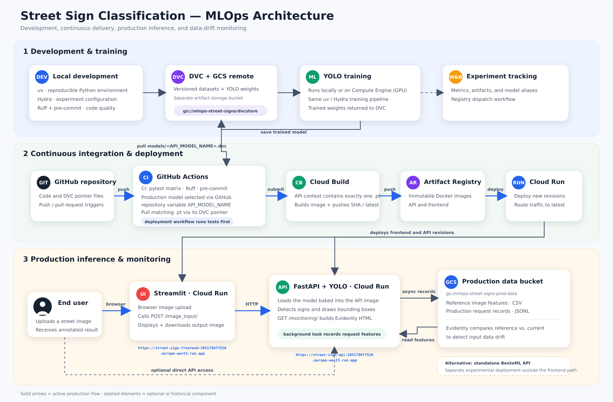

# Street Sign Detection — End-to-End MLOps

[![Tests][tests-badge]][tests-workflow]
[![Ruff][ruff-badge]][ruff-workflow]
[![Deploy API][api-badge]][api-workflow]
[![Deploy frontend][ui-badge]][frontend-workflow]

An end-to-end MLOps project for detecting and classifying street signs in images. The project fine-tunes an
Ultralytics YOLO model on 73 street-sign classes, serves predictions through FastAPI and Streamlit, and automates data
versioning, experiment tracking, testing, container builds, deployment, and production drift monitoring.

## Live application

- [Streamlit frontend][live-frontend] — Upload an image, run inference, inspect the bounding boxes, and download the
  annotated result.
- [FastAPI backend][live-api] — Open the production inference service deployed on Google Cloud Run.
- [Swagger UI][live-swagger] — Explore and call the backend endpoints from the browser.

The Cloud Run services can scale to zero, so the first request after an idle period may take a little longer.

[![Street Sign Prediction frontend showing a detected no-entry sign][frontend-screenshot]][live-frontend]

## Highlights

- Detects and classifies 73 street-sign classes with an Ultralytics YOLO model.
- Versions raw data, processed data, and trained model weights with DVC and Google Cloud Storage.
- Configures training with Hydra and tracks metrics, plots, parameters, and model artifacts in Weights & Biases.
- Serves the model through FastAPI, a Streamlit frontend, and an alternative BentoML service.
- Records production image features and prediction summaries for Evidently data-drift reports.
- Exposes Prometheus request, error, and prediction-latency metrics.
- Tests across supported Python and operating-system combinations with GitHub Actions.
- Builds images with Google Cloud Build, stores them in Artifact Registry, and deploys them to Cloud Run.

## Architecture



The pipeline connects DVC-managed datasets, Hydra-configured model training, Weights & Biases experiment tracking,
containerized inference, automated CI/CD, and production monitoring. The frontend sends uploaded images to the FastAPI
service; the API returns an annotated image and writes monitoring records asynchronously for drift analysis.

## Technology stack

| Area | Tools |
| --- | --- |
| Model and image processing | Ultralytics YOLO, PyTorch, OpenCV |
| Data and model versioning | DVC, Google Cloud Storage |
| Configuration and experiments | Hydra, Weights & Biases |
| Serving | FastAPI, Streamlit, BentoML, Uvicorn |
| Monitoring | Evidently, Prometheus metrics, Google Cloud Storage |
| Testing and quality | pytest, Coverage.py, Ruff, pre-commit, Locust |
| Delivery | Docker, GitHub Actions, Google Cloud Build, Artifact Registry, Cloud Run |
| Documentation | MkDocs Material, mkdocstrings |

## Quick start

### Prerequisites

- Git
- [`uv`](https://docs.astral.sh/uv/) for Python and dependency management
- Python 3.12 or 3.13
- Access to the configured DVC Google Cloud Storage remote for downloading the datasets and model weights
- Docker, only for the containerized workflows

### Install the project

```bash
git clone https://github.com/KenKbs/MLOPSStreetSignClassification.git
cd MLOPSStreetSignClassification
uv sync --dev --locked
uv run dvc pull
```

`uv sync --dev --locked` recreates the environment from `uv.lock`. `dvc pull` restores the datasets and trained model
weights that are intentionally not stored directly in Git.

### Run the application locally

Start the Streamlit frontend together with its local FastAPI backend:

```bash
uv run invoke start-local-frontend
```

Open <http://localhost:8501>. The API is available at <http://localhost:8000>, with Swagger UI at
<http://localhost:8000/docs>.

To run only the API:

```bash
uv run invoke start-local-api
```

To run the frontend and API with Docker Compose:

```bash
uv run invoke docker-frontend
```

## API

| Method | Endpoint | Purpose |
| --- | --- | --- |
| `GET` | `/` | Service welcome and availability check |
| `POST` | `/image_input/` | Upload an image and receive an annotated JPEG |
| `GET` | `/metrics` | Prometheus request, error, and latency metrics |
| `GET` | `/monitoring/` | Evidently data-drift report built from production records |
| `GET` | `/docs` | Interactive OpenAPI documentation |

Send an image to the deployed API:

```bash
curl -X POST \
  "https://street-sign-api-205178077520.europe-west3.run.app/image_input/" \
  -F "data=@path/to/image.jpg" \
  --output prediction.jpg
```

## Data and training

The Hydra defaults live in [`configs/config.yaml`](configs/config.yaml). The dataset follows the YOLO image/label
layout described in [`data/dataset.yaml`](data/dataset.yaml).

Prepare the data and recreate the dataset definition:

```bash
uv run invoke preprocess-data
uv run invoke create-yaml
```

Initialize the local model-quality registry, then train with the default configuration or CLI overrides:

```bash
uv run invoke create-models-quality-yaml
uv run invoke train
uv run invoke train --epochs 100 --batch-size 8 --lr0 0.005 --freeze 10
```

Additional experiment commands:

```bash
uv run invoke tune            # start the W&B sweep from configs/sweep.yaml
uv run invoke profile-train   # profile a one-epoch run with cProfile and SnakeViz
```

Training runs log their configuration, detection metrics, loss curves, and model artifact to Weights & Biases. The
trained weights are also saved under `models/`.

## Testing and code quality

```bash
uv run invoke test
uv run invoke test-coverage
uv run ruff check . --fix
uv run ruff format .
uv run pre-commit run --all-files
```

The standard test task runs the unit and API suites and excludes the Locust performance tests. Run the default
headless load test against a running local API with:

```bash
uv run invoke stress-api
```

Use `uv run invoke stress-api --ui` to start the Locust web interface, or pass `--host` to target another deployment.

## Containers and serving options

```bash
uv run invoke docker-build      # build training, evaluation, API, and frontend images
uv run invoke docker-train      # run training in Docker
uv run invoke docker-evaluate   # run evaluation in Docker
uv run invoke docker-api        # serve FastAPI at http://localhost:8000
uv run invoke docker-frontend   # serve the complete app at http://localhost:8501
uv run invoke start-bento       # build and run the BentoML API at http://localhost:3000
uv run invoke test-bento        # send a smoke-test request to BentoML
```

## Deployment

The primary production paths are the GitHub Actions workflows for the
[FastAPI backend](.github/workflows/deploy_api.yaml) and
[Streamlit frontend](.github/workflows/deploy_frontend.yaml). On relevant changes to `main`, they run the tests, build
commit-tagged container images with Cloud Build, push them to Artifact Registry, and deploy them to Cloud Run. The API
workflow also pulls the selected model from DVC before building its image.

Local fallback deployment commands are available when the Google Cloud CLI is authenticated and the required project
permissions are configured:

```bash
uv run invoke deploy-api
uv run invoke deploy-frontend
uv run invoke deploy-bento
```

Deployment settings can be overridden with the environment variables documented in the corresponding scripts under
[`scripts/`](scripts/) and in the [project documentation](docs/source/index.md).

## Monitoring

Every successful inference schedules a background task that extracts image characteristics, summarizes detections,
and stores a production record. Evidently compares those records with a reference feature set to generate the drift
report exposed at `/monitoring/`.

Generate or refresh the reference feature set in the configured monitoring bucket:

```bash
uv run invoke create-datadrift-reference
```

See the [monitoring documentation](docs/source/reference/monitoring.md) for feature definitions, storage behavior,
Prometheus metrics, and Cloud Run alerting guidance.

## Documentation

Build or serve the MkDocs site locally:

```bash
uv run invoke build-docs
uv run invoke serve-docs
```

The source documentation is under [`docs/source/`](docs/source/) and is automatically published by the
[`deploy_docs.yaml`](.github/workflows/deploy_docs.yaml) workflow after pushes to `main`.

## Repository layout

```text
├── .github/workflows/       # CI, model checks, documentation, and Cloud Run deployment
├── configs/                 # Hydra training configuration, sweep, and class mappings
├── data/                    # DVC-tracked raw and preprocessed datasets plus YOLO dataset YAML
├── dockerfiles/             # Training, evaluation, FastAPI, and Streamlit images
├── docs/                    # MkDocs site and image assets
├── models/                  # DVC model pointers and locally restored weights
├── scripts/                 # Local Google Cloud deployment scripts
├── src/street_sign_project/ # Data, training, serving, and monitoring package
├── tests/                   # Unit, API, and performance tests
├── docker-compose.yaml      # Local multi-container services
├── pyproject.toml           # Project metadata, dependencies, and tool configuration
└── tasks.py                 # Invoke task entry points
```

Run `uv run invoke --list` for the complete command reference.

## License

This project is available under the [MIT License](LICENSE).

[api-badge]: https://github.com/KenKbs/MLOPSStreetSignClassification/actions/workflows/deploy_api.yaml/badge.svg
[api-workflow]: https://github.com/KenKbs/MLOPSStreetSignClassification/actions/workflows/deploy_api.yaml
[frontend-screenshot]: docs/source/assets/frontend_screenshot.png
[frontend-workflow]: https://github.com/KenKbs/MLOPSStreetSignClassification/actions/workflows/deploy_frontend.yaml
[live-api]: https://street-sign-api-205178077520.europe-west3.run.app/
[live-frontend]: https://street-sign-frontend-205178077520.europe-west3.run.app
[live-swagger]: https://street-sign-api-205178077520.europe-west3.run.app/docs
[ruff-badge]: https://github.com/KenKbs/MLOPSStreetSignClassification/actions/workflows/codecheck.yaml/badge.svg
[ruff-workflow]: https://github.com/KenKbs/MLOPSStreetSignClassification/actions/workflows/codecheck.yaml
[tests-badge]: https://github.com/KenKbs/MLOPSStreetSignClassification/actions/workflows/tests.yaml/badge.svg
[tests-workflow]: https://github.com/KenKbs/MLOPSStreetSignClassification/actions/workflows/tests.yaml
[ui-badge]: https://github.com/KenKbs/MLOPSStreetSignClassification/actions/workflows/deploy_frontend.yaml/badge.svg
