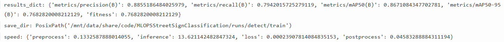
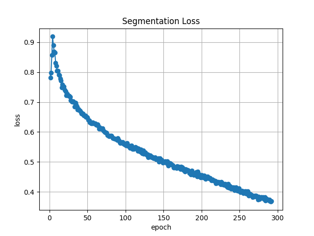

# Exam template for 02476 Machine Learning Operations

This is the report template for the exam. Please only remove the text formatted as with three dashes in front and behind
like:

`--- question 1 fill here ---`

Where you instead should add your answers. Any other changes may have unwanted consequences when your report is
auto-generated at the end of the course. For questions where you are asked to include images, start by adding the image
to the `figures` subfolder (please only use `.png`, `.jpg` or `.jpeg`) and then add the following code in your answer:

``

In addition to this markdown file, we also provide the `report.py` script that provides two utility functions:

Running:

```bash
python report.py html
```

Will generate a `.html` page of your report. After the deadline for answering this template, we will auto-scrape
everything in this `reports` folder and then use this utility to generate a `.html` page that will be your serve
as your final hand-in.

Running

```bash
python report.py check
```

Will check your answers in this template against the constraints listed for each question e.g. is your answer too
short, too long, or have you included an image when asked. For both functions to work you mustn't rename anything.
The script has two dependencies that can be installed with

```bash
pip install typer markdown
```

or

```bash
uv add typer markdown
```

## Overall project checklist

The checklist is _exhaustive_ which means that it includes everything that you could do on the project included in the
curriculum in this course. Therefore, we do not expect at all that you have checked all boxes at the end of the project.
The parenthesis at the end indicates what module the bullet point is related to. Please be honest in your answers, we
will check the repositories and the code to verify your answers.

### Week 1

- [x] Create a git repository (M5)
- [x] Make sure that all team members have write access to the GitHub repository (M5)
- [x] Create a dedicated environment for you project to keep track of your packages (M2)
- [x] Create the initial file structure using cookiecutter with an appropriate template (M6)
- [x] Fill out the `data.py` file such that it downloads whatever data you need and preprocesses it (if necessary) (M6)
- [x] Add a model to `model.py` and a training procedure to `train.py` and get that running (M6)
- [x] Remember to either fill out the `requirements.txt`/`requirements_dev.txt` files or keeping your
      `pyproject.toml`/`uv.lock` up-to-date with whatever dependencies that you are using (M2+M6)
- [x] Remember to comply with good coding practices (`pep8`) while doing the project (M7)
- [x] Do a bit of code typing and remember to document essential parts of your code (M7)
- [x] Setup version control for your data or part of your data (M8)
- [x] Add command line interfaces and project commands to your code where it makes sense (M9)
- [x] Construct one or multiple docker files for your code (M10)
- [x] Build the docker files locally and make sure they work as intended (M10)
- [x] Write one or multiple configurations files for your experiments (M11)
- [x] Used Hydra to load the configurations and manage your hyperparameters (M11)
- [x] Use profiling to optimize your code (M12)
- [x] Use logging to log important events in your code (M14)
- [x] Use Weights & Biases to log training progress and other important metrics/artifacts in your code (M14)
- [x] Consider running a hyperparameter optimization sweep (M14)
- [not applicable] Use PyTorch-lightning (if applicable) to reduce the amount of boilerplate in your code (M15)

### Week 2

- [x] Write unit tests related to the data part of your code (M16)
- [x] Write unit tests related to model construction and or model training (M16)
- [x] Calculate the code coverage (M16)
- [x] Get some continuous integration running on the GitHub repository (M17)
- [x] Add caching and multi-os/python/pytorch testing to your continuous integration (M17)
- [x] Add a linting step to your continuous integration (M17)
- [x] Add pre-commit hooks to your version control setup (M18)
- [x] Add a continues workflow that triggers when data changes (M19)
- [x] Add a continues workflow that triggers when changes to the model registry is made (M19)
- [x] Create a data storage in GCP Bucket for your data and link this with your data version control setup (M21)
- [x] Create a trigger workflow for automatically building your docker images (M21)
- [x] Get your model training in GCP using either the Engine or Vertex AI (M21)
- [x] Create a FastAPI application that can do inference using your model (M22)
- [x] Deploy your model in GCP using either Functions or Run as the backend (M23)
- [x] Write API tests for your application and setup continues integration for these (M24)
- [x] Load test your application (M24)
- [x] Create a more specialized ML-deployment API using either ONNX or BentoML, or both (M25)
- [x] Create a frontend for your API - FastAPI was used (M26)

### Week 3

- [x] Check how robust your model is towards data drifting (M27)
- [x] Setup collection of input-output data from your deployed application (M27)
- [x] Deploy to the cloud a drift detection API (M27)
- [x] Instrument your API with a couple of system metrics (M28)
- [ ] Setup cloud monitoring of your instrumented application (M28)
- [x] Create one or more alert systems in GCP to alert you if your app is not behaving correctly (M28)
- [ ] If applicable, optimize the performance of your data loading using distributed data loading (M29)
- [ ] If applicable, optimize the performance of your training pipeline by using distributed training (M30)
- [ ] Play around with quantization, compilation and pruning for you trained models to increase inference speed (M31)

### Extra

- [x] Write some documentation for your application (M32)
- [x] Publish the documentation to GitHub Pages (M32)
- [x] Revisit your initial project description. Did the project turn out as you wanted?
- [x] Create an architectural diagram over your MLOps pipeline
- [x] Make sure all group members have an understanding about all parts of the project
- [x] Uploaded all your code to GitHub

## Group information

### Question 1

> **Enter the group number you signed up on <learn.inside.dtu.dk>**
>
> Answer:

_Wo finden wir die bzw haben wir eine???_ --> I guess not applicable?

### Question 2

> **Enter the study number for each member in the group**
>
> Example:
>
> _sXXXXXX, sXXXXXX, sXXXXXX_
>
> Answer:

Matrikelnummern:
**Kenny Kubsch**: 13145587
**Finn Schmidt**: 13046019

### Question 3

> **Did you end up using any open-source frameworks/packages not covered in the course during your project? If so**
> **which did you use and how did they help you complete the project?**
>
> Recommended answer length: 0-200 words.
>
> Example:
> _We used the third-party framework ... in our project. We used functionality ... and functionality ... from the_
> _package to do ... and ... in our project_.
>
> Answer:

The single most important third-party framework we used is **Ultralytics** (`ultralytics`), which provides the
YOLO (version 26) object-detection model. It is the backbone of our project: we wrapped its `YOLO` class in our own
`YOLOv26` class (`model.py`) and used its `train`, `predict` and `val` functionality to fine-tune a pretrained model
on our street-sign dataset and to run inference. We also relied on **OpenCV** (`opencv-python-headless`) for reading
images and drawing the predicted bounding boxes and class labels onto the returned images in both the FastAPI and
BentoML services. For reading the hand-curated class-mapping spreadsheet (`street_sign_class_mapping.xlsx`) we used
**openpyxl** (As we used two different Datasets and "combined" the classes where possible). These packages were not part of the core course material but let us build a working detection pipeline much faster than writing the equivalent code ourselves.

## Coding environment

> In the following section we are interested in learning more about you local development environment. This includes
> how you managed dependencies, the structure of your code and how you managed code quality.

### Question 4

> **Explain how you managed dependencies in your project? Explain the process a new team member would have to go**
> **through to get an exact copy of your environment.**
>
> Recommended answer length: 100-200 words
>
> Example:
> _We used ... for managing our dependencies. The list of dependencies was auto-generated using ... . To get a_
> _complete copy of our development environment, one would have to run the following commands_
>
> Answer:

We used **`uv`** as our package and environment manager. All dependencies are declared in `pyproject.toml`,
split into the main runtime dependencies and a `dev` dependency group (pytest, coverage, ruff, mypy, pre-commit,
mkdocs, etc.), and the exact resolved versions are pinned in `uv.lock`. To get an exact copy of the
environment, a new team member would need to run:

```bash
git clone <repo-url>
cd MLOPSStreetSignClassification
# install uv (https://docs.astral.sh/uv/)
uv sync --dev --locked
uv run dvc pull
```

`uv sync --dev --locked` recreates the virtual environment reproducibly, and `--locked` guarantees the versions
match `uv.lock`. The same command is used in every CI workflow, so the local and CI environments are identical.

### Question 5

> **We expect that you initialized your project using the cookiecutter template. Explain the overall structure of your**
> **code. What did you fill out? Did you deviate from the template in some way?**
>
> Recommended answer length: 100-200 words
>
> Example:
> _From the cookiecutter template we have filled out the ... , ... and ... folder. We have removed the ... folder_
> _because we did not use any ... in our project. We have added an ... folder that contains ... for running our_
> _experiments._
>
> Answer:

We initialised the project with the [`mlops_template`](https://github.com/SkafteNicki/mlops_template) cookiecutter
template. We filled out the `src/street_sign_project/` package (renamed from `project_name`) with `data.py`,
`dataset.py`, `model.py`, `train.py`, `evaluate.py`, `visualize.py`, `fast_api.py`, `bentoml_api.py`,
`streamlit_app.py`, `link_model.py` and `utils.py`. We also completed the `configs/` (Hydra config + sweep),
`dockerfiles/`, `tests/`, `.github/workflows/`, `docs/` and `models/` folders and `tasks.py` (invoke commands).

We extended the template with a top-level `data/` directory containing DVC-tracked raw and preprocessed datasets. We
added a `src/street_sign_project/monitoring/` sub-package for collecting image features and production records,
accessing GCS and generating Evidently drift reports. Additional extensions include Cloud Build configurations, local
Cloud Run deployment scripts in `scripts/`, and `API_uploads/` for local API files. Tests were separated into unit,
API and performance-test suites.

### Question 6

> **Did you implement any rules for code quality and format? What about typing and documentation? Additionally,**
> **explain with your own words why these concepts matters in larger projects.**
>
> Recommended answer length: 100-200 words.
>
> Answer:

We used **ruff** for both linting and formatting (line length 120, rule sets `E`, `W`, `I`, `B`, `NPY`, `PD`),
configured in `pyproject.toml`. Formatting and lint-with-autofix run as **pre-commit hooks** and also as a dedicated
CI workflow (`codecheck.yaml`), so no unformatted or lint-failing code reaches `main`. We use **type hints throughout the codebase** (function signatures, dataclasses,
`Literal`/`TypeAlias` types). Almost all functions and classes have a **docstring**.

These concepts matter in larger projects because multiple people edit the same code: consistent formatting removes
noisy diffs and pointless style discussions, linting catches likely bugs and bad patterns early, and type hints make
interfaces explicit so that mistakes (e.g. passing the wrong type into `YOLOv26.train`) are caught before runtime.
Documentation lets a new team member understand a module without reading every line, which is essential when the
project grows beyond what one person can keep in their head.

## Version control

> In the following section we are interested in how version control was used in your project during development to
> corporate and increase the quality of your code.

### Question 7

> **How many tests did you implement and what are they testing in your code?**
>
> Recommended answer length: 50-100 words.
>
> Answer:

In total we implemented **40 tests**. In the unit tests we cover the data pipeline (class-mapping loading, split-ratio
validation, YAML/CSV creation, preprocessing), the `YOLOv26` model wrapper (input validation for `predict`, saving,
loading) and the training orchestrator (that Hydra config values are correctly wired into `YOLOv26.train`). A large
group of tests covers our monitoring code (image feature extraction, production records, reference features, GCS
storage, drift report). API tests check the FastAPI routes with a `TestClient`, and one performance test checks that
a staged model is fast enough for deployment.

### Question 8

> **What is the total code coverage (in percentage) of your code? If your code had a code coverage of 100% (or close**
> **to), would you still trust it to be error free? Explain you reasoning.**
>
> Recommended answer length: 100-200 words.
>
> Answer:

The total code coverage of our source code is **67%** (measured with `coverage` over `src/street_sign_project`).
Coverage is high for the parts that are pure logic and easy to test in isolation — the data pipeline (`data.py`, 91%),
the monitoring modules (85–96%) and the training orchestrator (`train.py`, 93%) — and low for `model.py` (23%) and
`evaluate.py` (20%), because those wrap Ultralytics YOLO and would require downloading real model weights and running
inference to exercise fully.

Even if we had 100% coverage we would **not** trust the code to be error-free. Coverage only tells us which lines were
executed, not whether the assertions actually check the right behaviour, and not whether the model produces correct
predictions. Many bugs (wrong bounding-box math, data drift, bad hyperparameters, race conditions in the API
background tasks) live in the interaction between components and depend on the input data, none of which line coverage
can capture. Coverage is a useful floor, not a proof of correctness.

### Question 9

> **Did you workflow include using branches and pull requests? If yes, explain how. If not, explain how branches and**
> **pull request can help improve version control.**
>
> Recommended answer length: 100-200 words.
>
> Answer:

Yes. During the project, we started working with **feature branches and pull requests** rather than committing directly to `main`. Most new
functionalities (e.g. the API, BentoML service, data drift monitoring, cloud build) were developed on their own branches
and merged into `main` through a PR, which is visible in our git history (e.g. "Merge pull request for adding cloud
trained model to dvc"). We also used **GitHub Issues** to track project milestones and the individual items from the
project checklist. When a checklist item was completed, we closed the corresponding issue. We enabled **Dependabot**,
which opens weekly PRs to bump dependencies.

Pull requests improved our version control because CI (tests, ruff, pre-commit) runs on every PR, so broken or
unformatted code is caught before it reaches `main`, and because a PR gives the other team member a chance to review
the changes.

### Question 10

> **Did you use DVC for managing data in your project? If yes, then how did it improve your project to have version**
> **control of your data. If no, explain a case where it would be beneficial to have version control of your data.**
>
> Recommended answer length: 100-200 words.
>
> Answer:

Yes, we used **DVC** with a **Google Cloud Storage remote** (`gs://mlops-street-signs/dvcstore`). We version-control
the raw data (`data/raw.dvc`, ~900 MB, 16 399 files), the preprocessed data (`data/preprocessed.dvc`) and our trained
models (e.g. `models/YOLO_eps420_bs8_lr0.005_fr10_x.pt.dvc`), while keeping the large binaries out of git.

DVC improved the project because both team members (and every CI runner) can reproduce the exact same dataset and
models with a single `dvc pull`, instead of passing files around manually. Because the data is tied to git commits,
we can always check out an old commit and get exactly the data/model that belonged to it, which is essential for
reproducibility of experiments. It also enabled our automated **data-checker workflow** (`cml_data.yaml`): whenever a
`.dvc` file changes, the workflow pulls the data, computes dataset statistics and posts them as a CML comment on the
pull request.

### Question 11

> **Discuss you continuous integration setup. What kind of continuous integration are you running (unittesting,**
> **linting, etc.)? Do you test multiple operating systems, Python version etc. Do you make use of caching? Feel free**
> **to insert a link to one of your GitHub actions workflow.**
>
> Recommended answer length: 200-300 words.
>
> Example:
> _We have organized our continuous integration into 3 separate files: one for doing ..., one for running ... testing_
> _and one for running ... . In particular for our ..., we used ... .An example of a triggered workflow can be seen_
> _here: <weblink>_
>
> Answer:

We organised our continuous integration into three GitHub Actions workflows. **`tests.yaml`** installs the locked
environment with `uv` and runs our unit and API tests through `uv run invoke test`. It uses a matrix covering Ubuntu
and Windows with Python 3.12 and 3.13. Windows with Python 3.13 is currently excluded because of dependency
compatibility, leaving three tested combinations. The workflow uses the cache provided by `astral-sh/setup-uv`, keyed
by `uv.lock`, to reduce installation time.

**`codecheck.yaml`** runs Ruff linting and formatting commands, while **`pre_commits.yaml`** executes the configured
pre-commit hooks. These workflows run for pull requests targeting `main` and for relevant pushes, providing feedback
before changes are merged.

We also experimented with continuous-ML automation. **`cml_data.yaml`** reacts to pushed DVC-pointer changes, pulls
the corresponding data from GCS and generates dataset statistics using CML. **`stage_model.yaml`** is triggered through
a W&B model-registry event and was designed to performance-test a staged model before assigning it the `production`
alias.

Separate continuous-delivery workflows for the FastAPI API and Streamlit frontend first run the tests. The API
workflow also pulls the DVC-selected model. They then submit the build contexts to Cloud Build, store commit-tagged
images in Artifact Registry and deploy immutable revisions to Cloud Run. The complete local and automated deployment
process is described in **Question 24**.

An example test workflow can be seen here:
https://github.com/KenKbs/MLOPSStreetSignClassification/actions/workflows/pre_commits.yaml

## Running code and tracking experiments

> In the following section we are interested in learning more about the experimental setup for running your code and
> especially the reproducibility of your experiments.

### Question 12

> **How did you configure experiments? Did you make use of config files? Explain with coding examples of how you would**
> **run a experiment.**
>
> Recommended answer length: 50-100 words.
>
> Answer:

We used **Hydra** with a config file (`configs/config.yaml`) that holds all paths, model, training and W&B settings.
Experiments are launched through an **invoke** task that composes the Hydra config and lets us override any value on
the command line, for example:

```bash
uv run invoke train --epochs 100 --batch-size 8 --lr0 0.005 --freeze 10
```

Any parameter not passed uses the default from `config.yaml`. Hyperparameter sweeps are configured in
`configs/sweep.yaml` and run with `uv run invoke tune`.

### Question 13

> **Reproducibility of experiments are important. Related to the last question, how did you secure that no information**
> **is lost when running experiments and that your experiments are reproducible?**
>
> Recommended answer length: 100-200 words.
>
> Answer:

Reproducibility is secured on several levels. The **environment** is pinned with `uv.lock` and installed with
`uv sync --locked`. The **data and models** are versioned with DVC and tied to git commits, so a given commit always
corresponds to the same data. The **experiment configuration** is a Hydra config file, and every override is explicit
on the command line, so there are no hidden magic numbers. We set a fixed **random seed** (default 420) that is passed
into Ultralytics training. Finally, every run was logged to **Weights & Biases**, while the account was still active:
we log the config (lr, batch size, epochs, freeze), the metrics (mAP50, precision, miss rate), per-epoch loss curves,
and we upload the trained model as a **W&B artifact**. To reproduce a run one checks out the corresponding commit,
runs `uv sync --locked` and `dvc pull`, and re-runs the same invoke command; the config and metrics can always be
inspected in the W&B run.

### Question 14

> **Upload 1 to 3 screenshots that show the experiments that you have done in W&B (or another experiment tracking**
> **service of your choice). This may include loss graphs, logged images, hyperparameter sweeps etc. You can take**
> **inspiration from [this figure](figures/wandb.png). Explain what metrics you are tracking and why they are**
> **important.**
>
> Recommended answer length: 200-300 words + 1 to 3 screenshots.
>
> Answer:

We used **Weights & Biases** to keep the configuration and results of each training run together. For every run we
logged the learning rate, batch size, number of epochs and number of frozen layers, making it possible to compare
experiments without relying on filenames or terminal output alone.



The first screenshot shows the final validation results of our 420-epoch YOLO-X experiment. We primarily tracked
**mAP50**, **precision** and **miss rate**. The model achieved an mAP50 of approximately **0.867**, which summarizes
detection quality across classes at an intersection-over-union threshold of 0.5. Precision was approximately
**0.886**; high precision matters because it means that comparatively few predicted street signs are false positives.
Recall was approximately **0.794**, corresponding to the logged miss rate of about **0.206**. We included miss rate
because overlooked signs are an especially important failure mode for this application. The stricter mAP50-95 value
of approximately **0.768** additionally evaluates localization over multiple IoU thresholds. The output also reports
about **13.6 ms** inference time per image on the training machine, which helps assess whether the detector is suitable
for an interactive API.



The second screenshot shows one of the per-epoch loss curves logged through our training callback. The loss decreases
from roughly 0.9 to 0.37, with some noise during the first epochs, and then continues to decline more steadily. This
indicates that optimization converged rather than becoming unstable. Training loss alone does not demonstrate generalization, so we interpret it together with the
validation metrics above when comparing models.

### Question 15

> **Docker is an important tool for creating containerized applications. Explain how you used docker in your**
> **experiments/project? Include how you would run your docker images and include a link to one of your docker files.**
>
> Recommended answer length: 100-200 words.
>
> Answer:

We wrote several Docker images: a **training** image
(`dockerfiles/train.dockerfile`), an **evaluate** image (builds the models-quality YAML), an **API** image
(`api.dockerfile`, serves the FastAPI app) and a **frontend** image (`frontend.dockerfile`, the Streamlit app). In
addition we build a specialised **BentoML** image via `bentoml containerize`. A `docker-compose.yaml` wires the
train/evaluate/api/frontend services together with the right volume mounts. All Dockerfiles install dependencies in a separate,
cached layer (`uv sync --frozen --no-install-project`) before copying the source, so rebuilds are fast.

Examples of how we run them:

```bash
uv run invoke docker-build      # build train, evaluate, api and frontend images
uv run invoke docker-train      # run one training run in a container
uv run invoke docker-evaluate   # evaluate checkpoints and update models_quality.yaml
uv run invoke docker-api        # serve the API on localhost:8000
uv run invoke docker-frontend   # serve the frontend on localhost:8501
```

Link to the API Dockerfile: `dockerfiles/api.dockerfile`. Evaluation, API and frontend images can also built in the cloud via Cloud Build (`cloudbuild.yaml`, `cloudbuild_api.yaml`, `cloudbuild_frontend.yaml`) and are also part of continous deployment GH actions workflows.


### Question 16

> **When running into bugs while trying to run your experiments, how did you perform debugging? Additionally, did you**
> **try to profile your code or do you think it is already perfect?**
>
> Recommended answer length: 100-200 words.
>
> Answer:

For most logic bugs we relied on our **loguru** logging (info/warning/critical messages) and on plain
print/breakpoint debugging, plus the failing **pytest** tests which pointed us at the broken component. We tried the VS Code debugger and its breakpoint functionality, but found it less useful for long-running training and errors originating inside third-party libraries. For the
cloud/CI parts (W&B model-registry automation, Cloud Build, Cloud Run, GH runnners) we debugged mostly through the provided logs and by iterating on small test commits.
Moreover, team-member Kenny used LLM tools to explain unfamiliar error messages and suggest possible causes or debugging directions.

We did **profile** our code: `tasks.py` contains a `profile-train` task that runs one training run under `cProfile`,
writes a `.prof` file to `reports/profiling/` and then opens it in **snakeviz** for visual inspection.
We do not think our code is perfect — most of the runtime is inside Ultralytics/PyTorch, which we cannot meaningfully
optimise ourselves, so we focused our own optimisation on the data pipeline and Docker layer caching.

## Working in the cloud

> In the following section we would like to know more about your experience when developing in the cloud.

### Question 17

> **List all the GCP services that you made use of in your project and shortly explain what each service does?**
>
> Recommended answer length: 50-200 words.
>
> Answer:

We used the following GCP services:

- **Cloud Storage (Buckets):** stores our DVC-tracked data and models (`gs://mlops-street-signs/dvcstore`)
- **Cloud Build:** builds our Docker images in the cloud from `cloudbuild.yaml` / `cloudbuild_train.yaml`, triggered
  by GitHub Actions.
- **Artifact Registry:** stores the built Docker images (API, evaluate, train, frontend, BentoML).
- **Cloud Run:** serves our deployed containers (FastAPI API, Streamlit frontend and the BentoML service) as
  scalable, managed HTTP services.
- **IAM / Service Accounts:** service-account keys stored as GitHub secrets let the CI authenticate to GCP.
- **Compute Engine:** Get a virtual machine with GPU access for training
- **Billing** Monitor costs
- **Monitoring / Alerts:** Monitor performance and alert when something goes wrong.
- **Notification Channels:** Configure notification channels (like e-mail) for alerts

### Question 18

> **The backbone of GCP is the Compute engine. Explained how you made use of this service and what type of VMs**
> **you used?**
>
> Recommended answer length: 100-200 words.
>
> Answer:

We used the **Compute Engine** for the compute-heavy part of the project — training our YOLO model. Because
fine-tuning YOLO on our combined street-sign dataset is far too slow on CPU, we started a Compute Engine VM with a
GPU and ran the training there. The resulting model was then downloaded via scp and version-controlled with DVC,
so both members could use it. Specifications: g2-standard-4 (4 vCPUs, 16 GB Memory); 1 x NVIDIA L4 GPU.
In addition, team member Kenny had access to a privately managed GPU server, equipped with an NVIDIA GeForce RTX 2070 super. Although this machine was not a GCP service, it followed the same training process used on the GC compute machine.

### Question 19

> **Insert 1-2 images of your GCP bucket, such that we can see what data you have stored in it.**
> **You can take inspiration from [this figure](figures/bucket.png).**
>
> Answer:

We used two buckets for project data. **`mlops-street-signs`** is the remote storage for DVC. The first screenshot
shows the content-addressed objects below `dvcstore/files/md5`; DVC maps the small pointer files committed to Git to
these objects, allowing us to version the raw and preprocessed datasets and model checkpoints without storing large
files in the repository.


**`mlops-street-signs-prod-data`** stores data collected from the deployed API for monitoring. Its `production/`
prefix contains dated request records, while `reference/datadrift_reference_features.csv` contains the baseline image
features. Evidently compares the production features with this reference data to generate the drift report.


### Question 20

> **Upload 1-2 images of your GCP artifact registry, such that we can see the different docker images that you have**
> **stored. You can take inspiration from [this figure](figures/registry.png).**
>
> Answer:

We used one regional Docker repository in Google Artifact Registry, named **`docker-registry`** and located in
`europe-west3`. Cloud Build pushes the versioned container images produced by our build and deployment workflows to
this repository.


The repository contains four images: **`street-sign-api`**, **`street-sign-frontend`**, **`street-sign-bento-api`** and
**`street-sign-evaluate`**. The FastAPI and Streamlit frontend images are the two active production images deployed to
Cloud Run. The BentoML image contains our first working deployment iteration and provides the core inference
functionality. For the later production-data, data-drift and API-monitoring work, we continued development with
FastAPI. The evaluation image is used as a batch utility for evaluating checkpoints and updating the model-quality
data.


### Question 21

> **Upload 1-2 images of your GCP cloud build history, so we can see the history of the images that have been build in**
> **your project. You can take inspiration from [this figure](figures/build.png).**
>
> Answer:

The Cloud Build history shows **13 successful builds** between June 22 and July 19. We initially used Cloud Build for
the evaluation image and later integrated it into the GitHub Actions deployment workflows for the FastAPI and
Streamlit frontend images. Each build receives the prepared source context, builds the corresponding Dockerfile, tags
the image and pushes it to the `docker-registry` Artifact Registry repository.


### Question 22

> **Did you manage to train your model in the cloud using either the Engine or Vertex AI? If yes, explain how you did**
> **it. If not, describe why.**
>
> Recommended answer length: 100-200 words.
>
> Answer:

Yes, we trained our model in the cloud using the **Compute Engine**. We pulled our code and the DVC-tracked data onto it, and ran the
training with our reproducible `uv`/Hydra setup (`uv run invoke train`, using the same training code and
`config.yaml` as locally). Depending on the training run, the resulting checkpoint was either copied back to a local
machine with `scp` and subsequently added to DVC, or added and pushed directly from the Compute Engine VM to our DVC
GCS remote. In both cases, only the small `.dvc` pointer file was committed to Git.
We chose the Engine (rather than Vertex AI) because it gave us a straightforward GPU machine on which our
existing training pipeline runs unchanged, which kept the setup simple and fully reproducible.

## Deployment

### Question 23

> **Did you manage to write an API for your model? If yes, explain how you did it and if you did anything special. If**
> **not, explain how you would do it.**
>
> Recommended answer length: 100-200 words.
>
> Answer:

Yes, we wrote an API with **FastAPI** (`fast_api.py`). The model is loaded once on startup via a `lifespan` context
manager. The main endpoint, `POST /image_input/`, accepts an uploaded image, assigns it a unique request ID, runs
`YOLOv26.predict`, draws the detected bounding boxes with human-readable class names and confidence scores using
OpenCV, and returns the annotated image as a `FileResponse`.

We use FastAPI **BackgroundTasks** to extract image features and write a monitoring record containing the prediction
summary and request metadata to GCS after the response is sent. This keeps the monitoring work outside the critical
response path. The `GET /monitoring/` endpoint builds and returns an Evidently data-drift report as HTML, while
`GET /metrics` exposes Prometheus request, error and prediction-latency metrics.

Before focusing on FastAPI, we implemented the same core detection functionality as a working **BentoML** service
using its `@bentoml.service` and `@bentoml.api` decorators. For the later production-data, data-drift and API-monitoring
work, we continued development with FastAPI.

### Question 24

> **Did you manage to deploy your API, either in locally or cloud? If not, describe why. If yes, describe how and**
> **preferably how you invoke your deployed service?**
>
> Recommended answer length: 100-200 words.
>
> Answer:

Yes, we supported three ways of running or deploying the application:

**Local development:** The FastAPI service runs with `uv run invoke start-local-api` at `localhost:8000`. The Streamlit
frontend can be started with `uv run invoke start-local-frontend`, while `docker-api` and `docker-frontend` provide
containerized local variants.

**Local cloud deployment:** The `deploy-api` and `deploy-frontend` Invoke tasks call shell scripts on the developer
machine. These scripts build the Docker image locally, tag it with a timestamp and commit identifier, and push the
built image to Artifact Registry. They then explicitly call `gcloud run deploy`, create a new Cloud Run revision and
route traffic to it. This path does not use Cloud Build.

**Continuous deployment:** Relevant changes pushed to `main` trigger separate GitHub Actions workflows for FastAPI
and the frontend. The runner executes the tests; the API workflow also pulls the selected model with DVC. The source
context is submitted to Cloud Build, which builds and pushes commit-tagged images to Artifact Registry. The workflow
then deploys the immutable image to Cloud Run. Users access the API through its public Cloud Run URL, either directly
or through the Streamlit frontend.

### Question 25

> **Did you perform any functional testing and load testing of your API? If yes, explain how you did it and what**
> **results for the load testing did you get. If not, explain how you would do it.**
>
> Recommended answer length: 100-200 words.
>
> Answer:

Yes. For **functional testing**, we used pytest with FastAPI's `TestClient` (`tests/apitests/test_api.py`). The tests
verify the root and OpenAPI routes, image inference responses, Evidently monitoring HTML and Prometheus metrics. They
also check background-record creation and error metrics while replacing the real model with a lightweight fake. These
tests run automatically in CI.

For **stress testing**, we used Locust (`tests/performancetests/locustfile.py`). Simulated users repeatedly select
random test images, upload them to `POST /image_input/`, and verify that the response has status 200 and contains an
annotated JPEG. We tested both an API running on a developer machine and the API deployed on Cloud Run. The easiest
way to configure a test is:

```bash
uv run invoke stress-api --ui
```

The Locust UI allows us to select the local or cloud host, number of users and spawn rate. In the displayed cloud test,
ten concurrent users produced approximately **1.33 requests per second with 0% failures**. At the end of the test, the
median response time was approximately **5.5 seconds**, while the 95th percentile was approximately **6.1 seconds**.


### Question 26

> **Did you manage to implement monitoring of your deployed model? If yes, explain how it works. If not, explain how**
> **monitoring would help the longevity of your application.**
>
> Recommended answer length: 100-200 words.
>
> Answer:

Yes, we implemented **data-drift monitoring**. For every request, the deployed API extracts tabular image features and a
prediction summary and writes them as a JSONL **production record** to a GCS bucket via a background task.
We also generated a **reference** feature set
from our training images. The `GET /monitoring/` endpoint loads the reference and production features from GCS and
uses **Evidently** (`DataDriftPreset`) to build an HTML drift report, so we can see whether the images arriving in
production differ from the training distribution. We also instrumented the API with **Prometheus** request-count,
error-count and prediction-latency metrics exposed through `GET /metrics`. For the deployed service, we configured a
GCP alert based on Cloud Run `5xx` responses; when the alert is triggered, both team members receive an email
notification.

## Overall discussion of project

> In the following section we would like you to think about the general structure of your project.

### Question 27

> **How many credits did you end up using during the project and what service was most expensive? In general what do**
> **you think about working in the cloud?**
>
> Recommended answer length: 100-200 words.
>
> Answer:

Our cloud usage was approximately $40 of GCP credits. The most expensive service was the GPU-enabled
**Compute Engine** VM used for model training, because it was billed for the full time that the VM was running. Cloud
Run and Cloud build remained comparatively inexpensive, as well as the cloud storage (GCP bucket).
In general, working in the cloud was a very positive experience. Managed services such as Cloud Run and Cloud Build
allowed us to move from a local Docker image to a publicly reachable service without managing the underlying servers. ("Serverless" deployment, no need to manage servers on our own)
Container images also made the local and cloud environments more consistent. The main disadvantages were the amount
of configuration, IAM and service-account setup, and the slower debugging cycle when failures occurred in remote build
or deployment logs instead of directly on a development machine.
Lastly, in the "main month" of development we used around 1.200 minutes of GH actions runner computing time with a total of 500 jobs run in one month.

### Question 28

> **Did you implement anything extra in your project that is not covered by other questions? Maybe you implemented**
> **a frontend for your API, use extra version control features, a drift detection service, a kubernetes cluster etc.**
> **If yes, explain what you did and why.**
>
> Recommended answer length: 0-200 words.
>
> Answer:

We implemented several extras. (1) A **Streamlit frontend** (`streamlit_app.py`), deployed to Cloud Run, allows
non-technical users to upload street images and view annotated predictions without calling the API manually.

(2) A custom **data-harmonization and splitting pipeline** (`data.py`) combines two datasets with different class
definitions. A curated mapping converts their labels into one shared class taxonomy. The pooled images are then
divided deterministically into train, validation and test sets using a multi-label-aware heuristic. Images containing
rare classes are assigned first.

(3) A **models-quality tracking** mechanism that keeps the best models by a simplified AP@50 metric.

(4) Created a **GitHubPage** which contains the documentation accessible under: https://kenkbs.github.io/MLOPSStreetSignClassification/

### Question 29

> **Include a figure that describes the overall architecture of your system and what services that you make use of.**
> **You can take inspiration from [this figure](figures/overview.png). Additionally, in your own words, explain the**
> **overall steps in figure.**
>
> Recommended answer length: 200-400 words
>
> Answer:


The starting point of our system is the **local development setup**. We manage the environment with `uv`, configure
experiments with **Hydra**, and version large datasets and trained checkpoints with **DVC**, using a GCS bucket as the
remote storage. Code quality is supported locally through Ruff and pre-commit hooks. Changes are pushed to **GitHub**,
where GitHub Actions runs pytest on three supported Ubuntu/Windows and Python 3.12/3.13 combinations, together with
Ruff and pre-commit checks. We used **Invoke** to perform most common repository actions; `uv run invoke --list`
shows all tasks that we created and used throughout the project.

Training happens either locally or in the cloud: the resulting model was logged to **Weights & Biases** (before the
test account was closed) and stored via DVC. W&B also acted as our **model registry**: assigning the `staging` alias to
a model artifact triggered, via `repository_dispatch`, a workflow that performance-tests the model and, on success,
promotes it to `production`. After the test account was closed, the production model is selected through the GitHub
repository variable **`API_MODEL_NAME`**.

For continuous deployment, the FastAPI and Streamlit workflows first run the tests. The API workflow pulls the
selected model from DVC and includes exactly that checkpoint in the build context. **Cloud Build** builds the API and
frontend images, pushes commit-specific and `latest` tags to **Artifact Registry**, and the workflows deploy the
immutable commit tags to **Cloud Run**. BentoML was our first working deployment iteration and was built separately;
later production and monitoring work focused on FastAPI.

Users upload images through the Streamlit frontend or directly to `POST /image_input/`. FastAPI returns an annotated
image and writes image features and prediction summaries to the production GCS bucket in a background task.
**Evidently** compares these records with reference features to detect drift. The API also exposes Prometheus metrics
through `/metrics`, while a GCP alert notifies both team members about Cloud Run `5xx` errors.

### Question 30

> **Discuss the overall struggles of the project. Where did you spend most time and what did you do to overcome these**
> **challenges?**
>
> Recommended answer length: 200-400 words.
>
> Answer:

Our main struggle was integrating all the components covered in the course into one complete system. The individual
tools were usually manageable on their own, but connecting DVC, GitHub Actions, Cloud Build, Artifact Registry, Cloud
Run and GCS required consistent authentication, configuration and data flow between several services.

The most time-consuming part was configuring cloud authentication and getting the deployment workflows to run
reliably. GitHub Actions acts as the orchestrator: the runner authenticates with GCP, accesses the DVC remote to
retrieve the selected model, submits the container build to Cloud Build and deploys the resulting image to Cloud Run.
A failure could originate from GitHub Actions, IAM permissions, DVC, Cloud Build or Cloud Run. Debugging was therefore
slow because we often had to inspect logs across multiple systems before identifying the actual cause.

The expiration of our W&B test account created an additional late-stage problem, as it interrupted the original
experiment-tracking and model-registry workflow. We worked around this by using a free W&B account where possible,
while relying on DVC and the GitHub repository variable `API_MODEL_NAME` for the final production-model selection.

Collaboration also presented an initial challenge. For Kenny, this was the first time collaborating on a GitHub
project with branches, pull requests and merge conflicts. Resolving conflicts was especially time-consuming at the
beginning, but became easier as we adopted smaller commits, pull requests and clearer ownership of individual tasks.

Refactoring and code cleanup also required more time than expected. As the system grew, previously written
functionality had to be reorganized into separate modules and scripts, configurations had to be consolidated, and
duplicated deployment logic had to be removed or documented.

GitHub Issues helped us remain organized by tracking the project checklist and closing tasks as they were completed.
We also experimented with a GitHub Project as a Kanban board, but concluded that the additional maintenance was
excessive for a two-person team. Overall, most of our effort went into integration, cloud authentication and making
the complete workflow reliable rather than implementing isolated components.

### Question 31

> **State the individual contributions of each team member. This is required information from DTU, because we need to**
> **make sure all members contributed actively to the project. Additionally, state if/how you have used generative AI**
> **tools in your project.**
>
> Recommended answer length: 50-300 words.
>
> Answer:

Our group had two members, **Finn Schmidt** and **Kenny Kubsch**, and the work was closely shared, with both members
touching most parts of the codebase (both have roughly the same number of commits).

Student **Finn Schmidt** focused on the `YOLOv26` model wrapper (`model.py`), the evaluation/model-quality logic, the
W&B experiment tracking and the automated **model-registry pipeline** (`link_model.py`, `stage_model.yaml`), the
`cml_data.yaml` CML data-checker workflow, the **FastAPI** API, and the Streamlit frontend.

Student **Kenny Kubsch** focused on the custom data pipeline and preprocessing (`data.py`, class mapping and
deterministic multi-label split), DVC/GCS data and model versioning, the Hydra configuration, and training profiling.
He also worked on several unit tests, Locust stress testing, the BentoML API, the initial Docker and Cloud Build/Cloud Run
deployment tooling, and the production monitoring functionality, including data collection, Evidently drift detection
and Prometheus metrics.

Both members contributed to the Docker setup, the CI workflows, the tests, final report and the documentation, and reviewed each
other's pull requests.

**Finn Schmidt** did not use any generative AI tools within VS Code (except for filling out the report). He only used the Gemini Browser version as an "extended Google".
**Kenny Kubsch** did use an API access for Codex (VS-Code extension), e.g. for:
- Code review
- Explaining changes which Finn made
- Explaining and resolving Merge conflicts
- Debugging support
- Drafting Pull Requests
- Opening GitHub Issues
- Understanding new FrameWorks and Concepts covered in the course.
